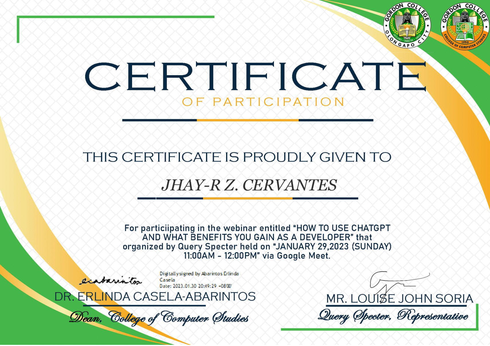

<!-- Typing Header -->

  

<!-- Counters & Badges -->

---

# :computer: Jhayr Cervantes

## :rocket: Developer | Designer | Creator

Hi! I'm **Jhayr** from the Philippines :philippines:.  
I enjoy building software, designing visuals, and editing videos — turning ideas into real-world solutions.

---

## 🏆 GitHub Trophies

---

## :bar_chart: GitHub Stats

---

## :memo: Certificates

<strong>:file_folder: Click here to explore my certificates</strong>

 

<table>
<tr>
<td align="center"> <b>AI Tech Trends</b></td>
<td align="center"> <b>Using ChatGPT</b></td>
<td align="center"> <b>Cybersecurity</b></td>
<td align="center"> <b>Google Data</b></td>
</tr>
<tr>
<td align="center"> <b>Laravel</b></td>
<td align="center"> <b>Cyber Talks</b></td>
<td align="center"> <b>PC Formatting</b></td>
<td align="center"> <b>PHP OOP</b></td>
</tr>
<tr>
<td align="center"> <b>AWS</b></td>
<td align="center"> <b>Python</b></td>
<td align="center"> <b>Google Sheets</b></td>
<td align="center"> <b>Software Eng</b></td>
</tr>
</table>

---

## :bust_in_silhouette: About Me

- 💻 Building **PHP systems, Java apps, and full-stack projects**
- 🌱 Learning **C/C++ systems programming & SQL tuning**
- 🎨 UI / Vector Design with **Photoshop & Illustrator**
- 🎬 Video editing using **Filmora & CapCut**
- 💬 Ask me about `PHP`, `Java`, `C/C++`, `SQL`, `UI Design`
- 📧 **jhayrcervantes0981@gmail.com**

---

## :toolbox: Tech & Creative Stack

### 💻 Programming Languages

### 🗄 Databases

### 🛠 Tools

---

## :bulb: Fun Fact
> I debug like a detective 🕵️ — every bug leaves clues.

---

  

